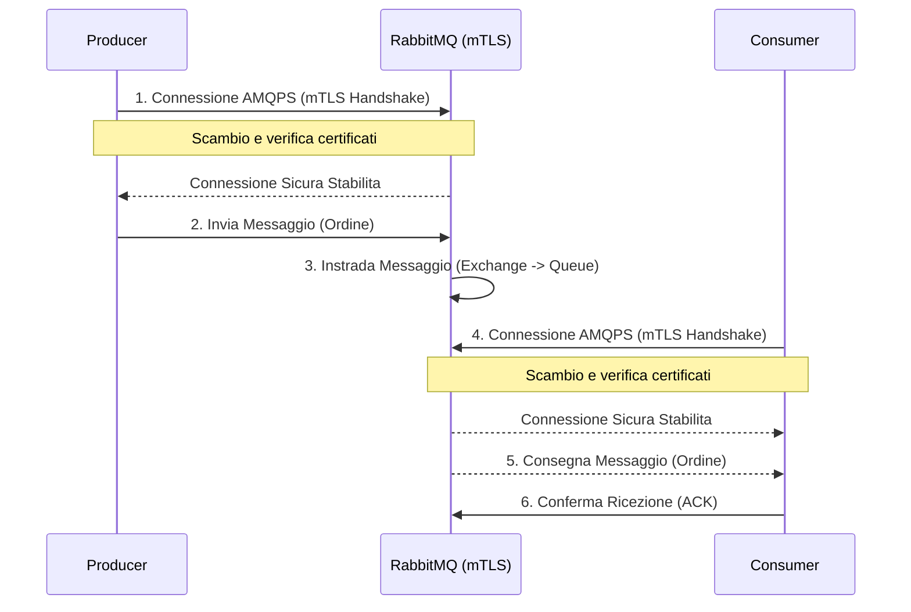

## Configurare RabbitMQ 4.1 mTLS e AMQP 1.0: Guida Pratica per Sviluppatori

Nello sviluppo software moderno, in particolare con architetture a microservizi o event-driven, i message broker come [RabbitMQ](https://www.rabbitmq.com/) rivestono un ruolo fondamentale. Garantire una comunicazione sicura con il broker e un ambiente di sviluppo quanto più simile possibile a quello di produzione è fondamentale per ridurre problemi in fase di deployment.

Questo articolo ti guiderà passo dopo passo nella configurazione di RabbitMQ 4.1 con Mutual TLS (mTLS) per comunicazioni sicure bidirezionali e con il supporto al protocollo [AMQP 1.0](https://docs.oasis-open.org/amqp/core/v1.0/os/amqp-core-overview-v1.0-os.html), il tutto gestito tramite Podman. Implementeremo un esempio pratico in Python utilizzando la libreria [Qpid Proton](https://qpid.apache.org/proton/index.html).

🎧 **Preferisci ascoltare?** Questo articolo è accompagnato da un episodio podcast dedicato che approfondisce gli stessi argomenti. Ascoltalo qui: [RabbitMQ 4.1 mTLS e AMQP 1.0 - Approfondimento Podcast](https://spotifycreators-web.app.link/e/wfx728cUsTb)

Con mTLS, sia il server RabbitMQ che i client (producer e consumer) si autenticano reciprocamente utilizzando certificati digitali. Questo rafforza ulteriormente la sicurezza rispetto al TLS standard, dove solo il client verifica il server. Utilizzeremo nomi di dominio completi (FQDN - Fully Qualified Domain Name) e [Subject Alternative Names (SAN)](https://en.wikipedia.org/wiki/Subject_Alternative_Name) per i certificati TLS server e certificati client dedicati, tutti firmati dalla stessa Certificate Authority (CA).

Per chi volesse seguire passo passo e avere a disposizione tutto il codice sorgente, gli script e il Makefile descritti in questa guida, il progetto completo è disponibile su GitHub: <https://github.com/amusarra/rabbitmq-mtls-poc>

## Perché questa configurazione è importante?

Configurare mTLS fin dall'ambiente di sviluppo ti permette di:

1. Massima sicurezza: Autenticazione reciproca tra client e server.
2. Individuare problemi di sicurezza in anticipo: Non rimandare la sicurezza all'ultimo minuto.
3. Abituarsi alle configurazioni reali: Meno sorprese durante il deploy in produzione.
4. Testare end-to-end in modo realistico: Comprendere l'impatto di mTLS e delle configurazioni di rete.
5. Utilizzare protocolli moderni: AMQP 1.0 offre interoperabilità e funzionalità avanzate.

## Prerequisiti

Prima di iniziare, assicurati di avere installato:

1. Make (versione >= 3.8): Per la gestione del progetto e l'automazione delle operazioni.
2. Podman (versione > 5.x): Per la gestione dei container.
3. OpenSSL (versione >= 3.3): Per la generazione dei certificati TLS.
4. Python 3 (versione >= 3.12): Per gli script di producer e consumer.
5. Librerie Python `python-qpid-proton` e `python-dotenv` che puoi installare con il comando `pip install python-qpid-proton python-dotenv`.
6. Possibilità di modificare il file `/etc/hosts` per la risoluzione del FQDN locale.

> **Nota:** Il progetto collegato a questo articolo è stato realizzato e testato su un sistema macOS 15.4.1 24E263 arm64, ma dovrebbe funzionare anche su altre distribuzioni Linux. Se hai bisogno di aiuto per l'installazione di Podman o OpenSSL, puoi consultare la documentazione ufficiale o chiedere supporto. La GitHub Action inclusa nel repository è stata testata su Ubuntu 22.04 e dovrebbe funzionare senza problemi.

## Struttura del Progetto

Il progetto è organizzato per facilitare la gestione di certificati, configurazioni e script di esempio, in modo che tu possa rapidamente avviare un ambiente RabbitMQ sicuro e testare producer/consumer scritti in questo caso in Python.

Ecco una panoramica della struttura tipica del repository:

```plaintext
rabbitmq-mtls-poc/
├── certs/
├── rabbitmq_config/
│   └── rabbitmq.conf
└── scripts/
    ├── producer.py
    └── consumer.py
```

**Descrizione delle principali cartelle e file:**

- `certs/`: Contiene tutti i certificati e le chiavi generate per mTLS. Questa directory è creata automaticamente dal Makefile.
- `rabbitmq_config/`: Contiene il file di configurazione di RabbitMQ (`rabbitmq.conf`) con le impostazioni per mTLS.
- `scripts/`: Contiene gli script di esempio Python per il producer e il consumer, che utilizzano la libreria Qpid Proton per comunicare con RabbitMQ.
- `Makefile`: Un file di automazione che semplifica la generazione dei certificati e la gestione del container RabbitMQ.
- `README.md`: Documentazione del progetto, con istruzioni dettagliate su come configurare e utilizzare RabbitMQ con mTLS.

## Configurazione di RabbitMQ per mTLS

Per abilitare la [mutua autenticazione TLS (mTLS) in RabbitMQ](https://www.rabbitmq.com/docs/ssl), è necessario configurare il broker affinché accetti solo connessioni cifrate e richieda la presentazione di un certificato valido anche da parte dei client. Questo garantisce che solo i client autorizzati e dotati di certificato firmato dalla CA possano interagire con RabbitMQ.

### Parametri chiave nel file di configurazione

Nel file `rabbitmq.conf` (che viene montato nel container RabbitMQ), assicurati di includere le seguenti direttive:

```ini
# Negazione del listener TCP standard
# RabbitMQ non accetterà connessioni non cifrate sulla porta 5672
# Questo è importante per forzare l'uso di TLS
listeners.tcp = none

# Abilita il listener TLS sulla porta 5671
listeners.ssl.default = 5671

# Percorsi dei certificati e della chiave privata del server
ssl_options.cacertfile = /etc/rabbitmq/certs/ca.pem
ssl_options.certfile   = /etc/rabbitmq/certs/server.pem
ssl_options.keyfile    = /etc/rabbitmq/certs/server.key

# Richiedi e verifica il certificato client
ssl_options.verify = verify_peer
ssl_options.fail_if_no_peer_cert = true
```

Questa configurazione obbliga RabbitMQ a:

- Accettare solo connessioni cifrate sulla porta 5671.
- Presentare il proprio certificato server ai client.
- Verificare che ogni client presenti un certificato valido e firmato dalla stessa CA.
- Rifiutare le connessioni da client privi di certificato o con certificato non valido.

Non è necessario modificare il file di configurazione di RabbitMQ per l'uso di AMQP 1.0, poiché questo protocollo è già supportato nativamente da RabbitMQ a partire dalla versione 4.0.

## Cosa fa il Makefile e come usarlo

Il [Makefile](https://www.gnu.org/software/make/manual/make.html) è un strumento molto potente che in questo progetto viene utilizzato per automatizzare la generazione dei certificati e la gestione del container RabbitMQ. Grazie a questo file, puoi facilmente creare un ambiente di sviluppo sicuro senza dover eseguire manualmente ogni singolo comando.

Il Makefile è pensato per essere idempotente e facilmente estendibile. Le principali operazioni automatizzate sono:

- **Creazione della CA locale**: genera la chiave privata e il certificato della Certificate Authority.
- **Generazione delle chiavi e CSR per server e client**: per ogni entità (server RabbitMQ, producer, consumer) vengono create chiavi private e richieste di firma.
- **Firma dei certificati**: la CA firma le CSR, producendo certificati validi per mTLS.
- **Gestione dei Subject Alternative Names (SAN)**: i certificati server includono i SAN necessari per il corretto funzionamento con FQDN e localhost.
- **Pulizia dell’ambiente**: con `make clean` puoi eliminare tutti i certificati e le chiavi generate, riportando il progetto allo stato iniziale.
- **Avvio e gestione del container RabbitMQ**: il Makefile include anche comandi per avviare, fermare e configurare RabbitMQ in modo semplice e veloce.
- **Configurazione di utenti e permessi**: tramite comandi `rabbitmqctl` o API HTTP, il Makefile si occupa di configurare gli utenti, i permessi e i vhost necessari per il corretto funzionamento del broker.
- **Configurazione della topologia**: crea exchange, queue e binding necessari per il corretto funzionamento degli script di esempio.

### Principali target del Makefile

Il Makefile del progetto è stato pensato per semplificare tutte le operazioni ricorrenti durante lo sviluppo e i test. Ecco una panoramica dei target più importanti:

- **certs**  
  Genera tutti i certificati necessari per mTLS: CA, server RabbitMQ, producer e consumer.  
  È il target da eseguire all’inizio per preparare l’ambiente di sicurezza.

- **clean**  
  Rimuove tutti i certificati e le chiavi generate, riportando il progetto allo stato iniziale.  
  Utile se vuoi rigenerare tutto da zero.

- **rabbitmq-pod-start**  
  Avvia il container RabbitMQ con la configurazione mTLS, montando i certificati e il file di configurazione.  
  Utilizza Podman (o Docker, se adattato).

- **rabbitmq-pod-stop**  
  Ferma e rimuove il container RabbitMQ avviato in precedenza.

- **rabbitmq-setup-permissions**  
  Configura utenti, permessi e vhost all’interno di RabbitMQ tramite comandi `rabbitmqctl`.  
  Garantisce che i client possano autenticarsi e accedere alle risorse corrette.

- **rabbitmq-setup-topology**  
  Crea exchange, queue e binding necessari per il corretto funzionamento degli script di esempio.

- **rabbitmq-logs**  
  Mostra in tempo reale i log del container RabbitMQ, utile per il debug e il monitoraggio.

- **all**  
  Esegue in sequenza i target fondamentali (`certs`, `rabbitmq-pod-start`, `rabbitmq-setup-permissions`, `rabbitmq-setup-topology`) per preparare l’intero ambiente con un solo comando.

### Flusso di Setup con Makefile

Il Makefile orchestra la creazione dell'intero ambiente di sviluppo sicuro. Ecco una visione d'insieme del processo attivato, ad esempio, dal comando `make all`:


Per avere un'idea visiva dell'intero processo di setup orchestrato dal Makefile, puoi guardare questa breve demo:

[](https://www.dontesta.it/wp-content/uploads/2020/11/registrazione_demo_setup_env_rabbitmq_41_mtls_1.gif)

#### Come scoprire tutti i target disponibili

Per vedere l’elenco completo dei target e una breve descrizione, puoi eseguire:

```bash
make help
```

### Personalizzazione del Makefile

Se vuoi aggiungere nuovi certificati client o modificare i parametri dei certificati (ad esempio, cambiare l'FQDN o aggiungere nuovi SAN), puoi modificare le variabili all’inizio del Makefile. Tutte le operazioni sono trasparenti e facilmente adattabili alle tue esigenze.

Vantaggi dell’approccio automatizzato

- **Ripetibilità**: Ogni volta che esegui `make certs`, ottieni gli stessi risultati, riducendo il rischio di errori umani.
- **Sicurezza**: riduci il rischio di errori manuali nella generazione dei certificati.
- **Velocità**: Risparmi tempo prezioso, specialmente in ambienti di sviluppo e test.
- **Facilità di integrazione**: Puoi integrare il Makefile nel tuo processo CI/CD per generare automaticamente i certificati in ambienti di test e produzione.

Consulta il Makefile incluso nel repository per tutti i dettagli sulle regole e sulle variabili configurabili.

## Gestione automatica dei certificati con il Makefile

Per semplificare e standardizzare la generazione dei certificati necessari per mTLS, il Makefile include il target `certs` che automatizza tutte le operazioni critiche: creazione della CA, generazione delle chiavi e delle richieste di firma (CSR), firma dei certificati server e client, e organizzazione dei file nelle cartelle corrette.

Per generare tutti i certificati necessari, ti basta eseguire:

```bash
make certs
```

L'output del comando sarà simile a questo:

```plaintext
Generating CA and Server certificates...
CA and Server certificates generated.
Generating Client certificates (Producer and Consumer)...
Producer client certificate generated: certs/order_sender_client.pem
Consumer client certificate generated: certs/delivery_receiver_client.pem
Client certificates generated.
All certificates generated in ./certs/
```

Questo comando creerà una directory `certs` con tutti i file necessari per la configurazione di RabbitMQ e dei client. A seguito della generazione, troverai:

- `ca.pem`: Certificato della CA.
- `server.pem`: Certificato del server RabbitMQ.
- `server.key`: Chiave privata del server RabbitMQ.
- `order_sender_client.key`: Chiave privata usata dallo script `producer.py` che rappresenta il producer.
- `order_sender_client.pem`: Certificato usato dallo script `producer.py` che rappresenta il producer.
- `delivery_receiver_client.key`: Chiave privata usata dallo script `consumer.py` che rappresenta il consumer.
- `delivery_receiver_client.pem`: Certificato usato dallo script `consumer.py` che rappresenta il consumer.

Nella lista precedente ho omesso volutamente il file `*.csr`, `*.srl` e `*.ext`, in quanto non sono necessari per l'esecuzione degli script di esempio. Questi file sono generati durante il processo di creazione dei certificati e possono essere utili per la diagnostica o per la verifica della corretta generazione dei certificati.

La configurazione dei Subject e dei Subject Alternative Names (SAN) sono state impostate in modo da garantire che i certificati siano validi per l'FQDN `rabbitmq.labs.dontesta.it` e per `localhost`, allo scopo di testare facilmente sia in locale che in ambienti di sviluppo. A seguire le variabili definite nel Makefile per la deefinizione dei Subject.

```makefile
# Subject settings
CA_SUBJECT = "/C=IT/ST=Sicilia/L=Bronte/O=Dontesta/OU=DevOps/CN=Dontesta-CA"
SERVER_SUBJECT = "/C=IT/ST=Sicilia/L=Bronte/O=Dontesta/OU=RabbitMQServer/CN=${RABBITMQ_FQDN}"
PRODUCER_SUBJECT = "/C=IT/ST=Sicilia/L=Bronte/O=Dontesta/OU=Client/CN=order_sender_client"
CONSUMER_SUBJECT = "/C=IT/ST=Sicilia/L=Bronte/O=Dontesta/OU=Client/CN=delivery_receiver_client"
```

Nel caso in cui tu voglia generare i certificati per un altro FQDN e Subject, sarà sufficiente eseguire il comando make come segue:

```bash
make certs \
    RABBITMQ_FQDN="my.custom.broker.com" \
    CA_SUBJECT="/C=US/ST=California/L=MyCity/O=MyOrg/OU=DevOps/CN=MyOrg-Custom-CA" \
    SERVER_SUBJECT="/C=US/ST=California/L=MyCity/O=MyOrg/OU=RabbitMQServer/CN=my.custom.broker.com" \
    PRODUCER_SUBJECT="/C=US/ST=California/L=MyCity/O=MyOrg/OU=Client/CN=custom_producer.client" \
    CONSUMER_SUBJECT="/C=US/ST=California/L=MyCity/O=MyOrg/OU=Client/CN=custom_consumer.client"
```

## Gestione di RabbitMQ tramite Makefile

Per rendere ancora più semplice la gestione dell’ambiente di sviluppo, il Makefile include anche un target dedicato all’avvio del container RabbitMQ già configurato per mTLS. In questo modo non dovrai ricordare o scrivere manualmente i comandi `podman run` o `docker run`.

### Come avviare RabbitMQ

Dopo aver generato i certificati con `make certs`, puoi avviare RabbitMQ già pronto all’uso (con vhost, utenti, permessi e topologia) usando il comando:

```bash
make rabbitmq-pod-start rabbitmq-setup-permissions rabbitmq-setup-topology
```

Questo comando eseguirà il container RabbitMQ con le configurazioni corrette e monterà i certificati generati nella directory `certs` all'interno del container.

> **Nota:** prima di eseguire lo start del container RabbitMQ, viene eseguito il target `hosts-check`, che verifica se il file `/etc/hosts` contiene la voce ${RABBITMQ_FQDN}. Se non è presente, il comando fallirà. Puoi aggiungere manualmente la riga al file `/etc/hosts`.

A seguire un esempio di output del comando:

```plaintext
Checking /etc/hosts for entry '127.0.0.1 rabbitmq.labs.dontesta.it'...
/etc/hosts is OK.
Starting RabbitMQ container (rabbitmq-dev-server) with image rabbitmq:4.1-management...
fc79be56d11261b0f193c1e8ca08756da6db005a580528da87e76906be77e25a
Container rabbitmq-dev-server created and started.
Waiting for RabbitMQ in container rabbitmq-dev-server to be ready...
RabbitMQ is ready.
Configuring RabbitMQ vhost, users, and permissions...
podman exec rabbitmq-dev-server rabbitmqctl add_vhost logistics_vhost || echo "Vhost logistics_vhost already exists."
Adding vhost "logistics_vhost" ...
Creating admin user: rabbit_admin
podman exec rabbitmq-dev-server rabbitmqctl add_user rabbit_admin 'SuperS3cureAdminP@ssw0rd!' || echo "User rabbit_admin already exists."
Adding user "rabbit_admin" ...
Done. Don't forget to grant the user permissions to some virtual hosts! See 'rabbitmqctl help set_permissions' to learn more.
podman exec rabbitmq-dev-server rabbitmqctl set_user_tags rabbit_admin administrator
Setting tags for user "rabbit_admin" to [administrator] ...
podman exec rabbitmq-dev-server rabbitmqctl set_permissions -p logistics_vhost rabbit_admin ".*" ".*" ".*"
Setting permissions for user "rabbit_admin" in vhost "logistics_vhost" ...
Creating application users...
podman exec rabbitmq-dev-server rabbitmqctl add_user order_sender 'OrderSenderP@ssw0rd' || echo "User order_sender already exists."
Adding user "order_sender" ...
Done. Don't forget to grant the user permissions to some virtual hosts! See 'rabbitmqctl help set_permissions' to learn more.
podman exec rabbitmq-dev-server rabbitmqctl add_user delivery_receiver 'DeliveryReceiverP@ssw0rd' || echo "User delivery_receiver already exists."
Adding user "delivery_receiver" ...
Done. Don't forget to grant the user permissions to some virtual hosts! See 'rabbitmqctl help set_permissions' to learn more.
Setting permissions for application users on vhost logistics_vhost...
podman exec rabbitmq-dev-server rabbitmqctl set_permissions -p logistics_vhost order_sender "" "^order_exchange$" ""
Setting permissions for user "order_sender" in vhost "logistics_vhost" ...
podman exec rabbitmq-dev-server rabbitmqctl set_permissions -p logistics_vhost delivery_receiver "" "" "^logistics_queue$"
Setting permissions for user "delivery_receiver" in vhost "logistics_vhost" ...
Vhost, users, and permissions configured.
Configuration topology RabbitMQ (exchange, queue, binding) with user rabbit_admin...
podman exec rabbitmq-dev-server rabbitmqadmin -u rabbit_admin -p 'SuperS3cureAdminP@ssw0rd!' -V logistics_vhost declare exchange name=order_exchange type=direct durable=true || echo "Exchange order_exchange already exists or error."
exchange declared
podman exec rabbitmq-dev-server rabbitmqadmin -u rabbit_admin -p 'SuperS3cureAdminP@ssw0rd!' -V logistics_vhost declare queue name=logistics_queue durable=true || echo "Queue logistics_queue already exists or error."
queue declared
podman exec rabbitmq-dev-server rabbitmqadmin -u rabbit_admin -p 'SuperS3cureAdminP@ssw0rd!' -V logistics_vhost declare binding source="order_exchange" destination_type="queue" destination="logistics_queue" routing_key="new_order_event" || echo "Binding already exists or error."
binding declared
Topology configured.
```

Se vuoi far tutto in un colpo solo, puoi eseguire il comando `make all`, che eseguirà in sequenza i target `certs`, `rabbitmq-pod-start`, `rabbitmq-setup-permissions` e `rabbitmq-setup-topology`.

Dall'output del comando di avvio puoi notare che il container RabbitMQ è stato avviato correttamente e che sono stati creati gli utenti, i permessi e la topologia necessaria per il corretto funzionamento degli script di esempio. Puoi anche notare che l'immagine RabbitMQ utilizzata è `rabbitmq:4.1-management`, che include l'interfaccia di gestione web e gli strumenti di monitoraggio e che il nome del container è `rabbitmq-dev-server`.

Il nome dell'immagine RabbitMQ è specificato nella variabile `PODMAN_IMAGE_NAME` del Makefile e il nome del container è specificato nella variabile `CONTAINER_NAME`. Puoi modificare questi valori se desideri utilizzare un'immagine diversa o un nome di container diverso.

### Come vedere i log di RabbitMQ

Puoi visualizzare i log di RabbitMQ in tempo reale con:

```bash
make rabbitmq-logs
```

Questo comando ti permetterà di monitorare le attività del broker e diagnosticare eventuali problemi. A seguire un esempio di output:

```plaintext
2025-05-16 13:22:50.696329+00:00 [info] <0.931.0> accepting AMQP connection 192.168.127.1:59736 -> 10.88.0.39:5671
2025-05-16 13:22:50.716750+00:00 [debug] <0.931.0> User 'order_sender' authenticated successfully by backend rabbit_auth_backend_internal
2025-05-16 13:22:50.718257+00:00 [info] <0.931.0> Connection from AMQP 1.0 container '062a2bba-b46d-46ba-a63c-c8323456ac9c': user 'order_sender' authenticated using SASL mechanism PLAIN and granted access to vhost 'logistics_vhost'
2025-05-16 13:22:50.718347+00:00 [debug] <0.931.0> AMQP 1.0 connection.open frame: hostname = vhost:logistics_vhost, extracted vhost = logistics_vhost, idle-time-out = undefined
2025-05-16 13:22:50.722351+00:00 [debug] <0.931.0> AMQP 1.0 created session process <0.936.0> for channel number 0
2025-05-16 13:22:50.731249+00:00 [debug] <0.931.0> AMQP 1.0 closed session process <0.936.0> with channel number 0
2025-05-16 13:22:50.736862+00:00 [info] <0.931.0> closing AMQP connection (192.168.127.1:59736 -> 10.88.0.39:5671, duration: '40ms')
```

Vedendo questo log è possibile notare che il producer `order_sender` si è autenticato correttamente e ha aperto una connessione AMQP 1.0 con RabbitMQ. Puoi anche vedere i dettagli della connessione, come l'hostname e il vhost utilizzato.

### Come fermare e riavviare RabbitMQ

Per fermare il container RabbitMQ, puoi eseguire:

```bash
make rabbitmq-pod-stop
```

Questo comando fermerà il container RabbitMQ in esecuzione mostrando un output simile a questo:

```plaintext
Stopping RabbitMQ container (rabbitmq-dev-server)...
rabbitmq-dev-server
```

Per riavviare il container RabbitMQ, puoi eseguire:

```bash
make rabbitmq-pod-start
```

Questo comando avvierà nuovamente il container RabbitMQ mostrando un output simile a questo:

```plaintext
Checking /etc/hosts for entry '127.0.0.1 rabbitmq.labs.dontesta.it'...
/etc/hosts is OK.
Starting RabbitMQ container (rabbitmq-dev-server) with image rabbitmq:4.1-management...
Container rabbitmq-dev-server exists but is not running. Removing it first...
24212a76d62a279e6d65922028aa12a9156e7f209b12ca81d17d6e9cf5473adc
Container rabbitmq-dev-server created and started.
Waiting for RabbitMQ in container rabbitmq-dev-server to be ready...
RabbitMQ is ready.
```

## Esempio di Producer e Consumer in Python

Vediamo ora come si struttura un tipico producer e un consumer Python che comunicano con RabbitMQ tramite AMQP 1.0 e mTLS, evidenziando solo le parti fondamentali e il loro scopo.

### Flusso di Comunicazione mTLS

Il diagramma seguente illustra il flusso di comunicazione sicuro tra il Producer, RabbitMQ e il Consumer, utilizzando mTLS e AMQP 1.0.



### Producer: invio di ordini in modo sicuro

**Caso d’uso:**  
Un microservizio producer deve inviare messaggi di **nuovo ordine** a RabbitMQ, garantendo che la comunicazione sia cifrata e autenticata tramite certificati; uno scenario comune in un’architettura a microservizi.

**Punti chiave nello script:**

- **Configurazione SSL/mTLS:**  
  Il producer carica i percorsi dei certificati CA, client e chiave privata, e configura Proton per la verifica reciproca.
- **Connessione protetta:**  
  La connessione viene stabilita usando l’URL `amqps://`, il vhost corretto e il parametro `sni` per l’[SNI (Server Name Indication)](https://it.wikipedia.org/wiki/Server_Name_Indication) TLS.
- **Generazione ordini random:**  
  Prima di inviare, il producer genera un numero configurabile di ordini con dati casuali (ID, descrizione, quantità).
- **Invio messaggi:**  
  Ogni ordine viene serializzato in JSON e inviato all’exchange configurato.  
  La conferma di avvenuta ricezione da parte di RabbitMQ viene gestita tramite callback.

### Consumer: ricezione sicura degli ordini

**Caso d’uso:**  
Un microservizio consumer si collega a RabbitMQ per ricevere e processare i messaggi degli ordini, sempre in modo autenticato e cifrato; uno scenario comune in un’architettura a microservizi.

**Punti chiave nello script:**

- **Configurazione SSL/mTLS:**  
  Anche il consumer carica i propri certificati e configura Proton per la verifica del server e la presentazione del certificato client.
- **Connessione protetta:**  
  Si connette al broker usando le stesse impostazioni di sicurezza del producer.
- **Ricezione e conferma:**  
  Riceve i messaggi dalla coda, li deserializza e li processa.  
  Dopo l’elaborazione, invia una conferma esplicita (ACK) a RabbitMQ per ogni messaggio ricevuto.
- **Gestione errori:**  
  In caso di errore di parsing o elaborazione, il messaggio può essere rilasciato o rifiutato, a seconda della logica implementata.

**Nota:**  
Entrambi gli script fanno uso delle stesse best practice:

- Percorsi assoluti per i certificati per evitare problemi di path traversal.
- Uso di variabili d’ambiente per parametri sensibili.
- Separazione chiara tra configurazione di sicurezza e logica applicativa.

Questa architettura ti permette di testare end-to-end la sicurezza e la robustezza della tua soluzione RabbitMQ già in fase di sviluppo.

## Punti di attenzione: AMQP 1.0, mTLS, Virtual Host e SNI con Proton

Quando si lavora con RabbitMQ, AMQP 1.0, mTLS e la libreria Proton, ci sono alcuni aspetti tecnici e trappole comuni che è importante conoscere per evitare errori difficili da diagnosticare.

### 1. AMQP 1.0, Virtual Host e Addressing

- **Addressing:**  
  RabbitMQ utilizza un sistema di addressing basato su virtual host, exchange e queue. È importante comprendere come questi elementi interagiscono tra loro per garantire una corretta instradamento dei messaggi. In particolare l'addressing AMQP 1.0 è diverso da quello di AMQP 0-9-1, introducendo la versione 2 di cui qui <https://www.rabbitmq.com/docs/amqp#address-v2> sono disponibili i dettagli.
- **Formato del Virtual Host:**  
  RabbitMQ, quando utilizza AMQP 1.0, si aspetta che il virtual host venga specificato in un formato particolare (es. `vhost:nome_vhost`).
  Se il formato non è corretto, la connessione viene accettata ma il client potrebbe non avere accesso alle risorse desiderate o ricevere errori di autorizzazione perché si collegherà al vhost di default.
- **Parametro `virtual_host` in Proton:**  
  Il parametro `virtual_host` passato alla funzione `connect()` di Proton deve corrispondere esattamente al nome del vhost configurato in RabbitMQ, e deve essere preceduto da `vhost:` (es. `vhost:logistics_vhost`).

### 2. mTLS: Certificati e Verifica

- **Verifica reciproca:**  
  Con mTLS, sia il client che il server devono presentare certificati validi e firmati dalla stessa CA.  
  Se anche solo uno dei due certificati non è valido o non è firmato dalla CA corretta, la connessione TLS fallisce.
- **Percorsi assoluti:**  
  Usa sempre percorsi assoluti per i certificati nei tuoi script, per evitare errori dovuti alla directory di lavoro corrente. È anche una buona pratica per evitare problemi di path traversal.
- **Subject Alternative Name (SAN):**  
  Il certificato server deve includere l'FQDN usato dal client (es. `rabbitmq.labs.dontesta.it`) nei SAN, altrimenti la verifica fallirà.

### 3. SNI (Server Name Indication) e Proton

- **SNI e verifica del certificato:**  
  Proton, per default, può usare il valore di `virtual_host` anche come SNI nell’handshake TLS.  
  Se il valore di SNI non corrisponde a un SAN valido nel certificato server, la verifica fallisce.
- **Soluzione:**  
  Usa sempre il parametro `sni` nella chiamata a `connect()` di Proton per forzare l’SNI corretto (es. il FQDN del server RabbitMQ).  
  Questo permette di separare la logica di autenticazione TLS da quella di routing AMQP.

### 4. Debug e risoluzione dei problemi

- **Errori di handshake TLS:**
  Spesso sono dovuti a mismatch tra SNI e SAN, o a CA non corretta.
- **Errori di autorizzazione AMQP:**
  Controlla sempre che il vhost sia corretto e che l’utente abbia i permessi necessari.
- **Log di RabbitMQ:**
  Consulta sempre i log del broker per capire se il problema è lato TLS, autenticazione, permessi o routing AMQP.

Quando usi Proton con RabbitMQ in mTLS e AMQP 1.0, presta particolare attenzione a come imposti virtual host e SNI, e assicurati che i certificati siano corretti e ben referenziati. Una configurazione attenta ti eviterà la maggior parte dei problemi tipici di interoperabilità e sicurezza.

Per aumentare il livello di trace e debug, puoi anche abilitare il logging dettagliato in RabbitMQ e nella libreria Proton. Questo ti aiuterà a diagnosticare eventuali problemi di connessione o di autenticazione.

In questo progetto di esempio, RabbitMQ è gia configurato con il livello di log `debug`, quindi puoi vedere in tempo reale cosa succede quando il producer e il consumer si connettono e inviano/ricevono messaggi.

Per quanto riguarda Proton, puoi abilitare un logging dettagliato eseguendo l'export della variabile d'ambiente PN_TRACE_FRM con il valore `1` prima di eseguire gli script Python. Questo ti permetterà di vedere i dettagli di trace sul protocol frame. Per maggiori informazioni sul logging di Proton, puoi consultare la [guida sul loggin pubblicata su GitHub](https://github.com/apache/qpid-proton/blob/main/c/docs/logging.md?plain=1).

```bash
export PN_TRACE_FRM=1
```

In questo modo, potrai ottenere informazioni dettagliate su cosa sta accadendo durante la connessione e l'invio/ricezione dei messaggi. Questo è particolarmente utile per il debug e per comprendere meglio il funzionamento interno di Proton e RabbitMQ.

A seguire un esempio di output del trace:

```plaintext
[0x11af7a710]: SASL:FRAME:  -> SASL
[0x11af7a710]: SASL:FRAME:  <- SASL
[0x11af7a710]: AMQP:FRAME:0 <- @sasl-mechanisms(64) [sasl-server-mechanisms=@<symbol>[:PLAIN, :AMQPLAIN, :ANONYMOUS]]
[0x11af7a710]: AMQP:FRAME:0 -> @sasl-init(65) [mechanism=:PLAIN, initial-response=b"\x00order_sender\x00OrderSenderP@ssw0rd"]
[0x11af7a710]: AMQP:FRAME:0 <- @sasl-outcome(68) [code=0x0]
[0x11af7a710]: AMQP:FRAME:  -> AMQP
[0x11af7a710]: AMQP:FRAME:0 -> @open(16) [container-id="c71222a8-93a9-498c-afac-2956a7b18892", hostname="vhost:logistics_vhost", max-frame-size=0x8000, channel-max=0x7fff]
[0x11af7a710]: AMQP:FRAME:0 -> @begin(17) [next-outgoing-id=0x0, incoming-window=0x7fffffff, outgoing-window=0x7fffffff, handle-max=0x7fffffff]
[0x11af7a710]: AMQP:FRAME:0 -> @attach(18) [name="c71222a8-93a9-498c-afac-2956a7b18892-/exchanges/order_exchange/new_order_event", handle=0x0, role=false, snd-settle-mode=0x2, rcv-settle-mode=0x0, source=@source(40) [durable=0x0, timeout=0x0, dynamic=false], target=@target(41) [address="/exchanges/order_exchange/new_order_event", durable=0x0, timeout=0x0, dynamic=false], initial-delivery-count=0x0, max-message-size=0x0]
[0x11af7a710]: AMQP:FRAME:  <- AMQP
[0x11af7a710]: AMQP:FRAME:0 <- @open(16) [container-id="rabbit@rabbitmq", max-frame-size=0x20000, channel-max=0x3f, idle-time-out=0x7530, offered-capabilities=@<symbol>[:"LINK_PAIR_V1_0", :ANONYMOUS-RELAY], properties={:node="rabbit@rabbitmq", :"cluster_name"="rabbit@rabbitmq", :copyright="Copyright (c) 2007-2025 Broadcom Inc and/or its subsidiaries", :information="Licensed under the MPL 2.0. Website: https://rabbitmq.com", :platform="Erlang/OTP 27.3.4", :product="RabbitMQ", :version="4.1.0"}]
[0x11af7a710]: AMQP:FRAME:0 <- @begin(17) [remote-channel=0x0, next-outgoing-id=0xfffffffc, incoming-window=0x190, outgoing-window=0xffffffff, handle-max=0xff]
[0x11af7a710]: AMQP:FRAME:0 <- @attach(18) [name="c71222a8-93a9-498c-afac-2956a7b18892-/exchanges/order_exchange/new_order_event", handle=0x0, role=true, snd-settle-mode=0x2, rcv-settle-mode=0x0, source=@source(40) [durable=0x0, timeout=0x0, dynamic=false], target=@target(41) [address="/exchanges/order_exchange/new_order_event", durable=0x0, timeout=0x0, dynamic=false], max-message-size=0x1000000]
[0x11af7a710]: AMQP:FRAME:0 <- @flow(19) [next-incoming-id=0x0, incoming-window=0x190, next-outgoing-id=0xfffffffc, outgoing-window=0xffffffff, handle=0x0, delivery-count=0x0, link-credit=0xaa]
[0x11af7a710]: AMQP:FRAME:0 -> @transfer(20) [handle=0x0, delivery-id=0x0, delivery-tag=b"1", message-format=0x0] (147) \x00SpE\x00Ss\xc0\x19\x07@@@@@@\xa3\x10application/json\x00Sw\xa1l{\x22order_id\x22: \x22ORD_MTLS_3CF4CF72\x22, \x22item_id\x22: \x22ITEM_B_167\x22, \x22description\x22: \x22Brilliant Gadget\x22, \x22quantity\x22: 3}
[0x11af7a710]: AMQP:FRAME:0 <- @disposition(21) [role=true, first=0x0, last=0x4, settled=true, state=@accepted(36) []]
[0x11af7a710]: AMQP:FRAME:0 -> @close(24) []
[0x11af7a710]: AMQP:FRAME:0 <- @close(24) []
[0x11af7a710]:   IO:FRAME:  <- EOS
[0x11af7a710]:   IO:FRAME:  -> EOS
```

Nel caso fosse necessario, puoi sempre consultare la [documentazione ufficiale di RabbitMQ](https://www.rabbitmq.com/) e [Qpid Proton](https://qpid.apache.org/proton/index.html) per ulteriori dettagli e best practices.

## Esecuzione di Producer e Consumer tramite Makefile

Il Makefile non solo automatizza la configurazione dell'ambiente, ma semplifica anche l'esecuzione degli script Python di producer e consumer. Questo è particolarmente utile per testare rapidamente le modifiche o per dimostrazioni.

### Installazione delle dipendenze Python

Prima di poter eseguire il producer o il consumer, assicurati che:

1. L'ambiente RabbitMQ sia completamente configurato e in esecuzione. Puoi ottenere questo risultato con il comando:

    ```bash
    make all
    ```

    Questo comando si occuperà di generare i certificati, avviare il container RabbitMQ, e configurare vhost, utenti, permessi e la topologia necessaria (exchange, code, binding).

2. Le dipendenze Python per gli script siano installate. Il Makefile fornisce un target per generare il file `requirements.txt`:

    ```bash
    make requirements
    ```

    Una volta generato, puoi installare le dipendenze (preferibilmente in un ambiente virtuale Python) con:

    ```bash
    pip install -r requirements.txt
    ```

In questo modo, l'utente viene guidato a installare le dipendenze necessarie prima di tentare di eseguire gli script, prevenendo errori comuni.

### Avviare il Producer

Per avviare lo script Python che funge da producer e invia messaggi a RabbitMQ, esegui:

```bash
make producer
```

Questo comando eseguirà lo script `producer.py`, che si connetterà a RabbitMQ utilizzando i certificati generati e inizierà a inviare messaggi di "nuovi ordini" all'exchange configurato (`/exchanges/order_exchange/new_order_event`).

A seguire un esempio di output del producer:

```plaintext
Running Producer Python script...
Producer: Generating 5 random orders...
Producer: Starting container to send 5 message(s)...
Producer: Starting, connecting to amqps://rabbitmq.labs.dontesta.it:5671/, target: /exchanges/order_exchange/new_order_event
Producer: SSL domain configured successfully.
Producer: Attempting mTLS connection to amqps://rabbitmq.labs.dontesta.it:5671/ with user order_sender on vhost vhost:logistics_vhost
Producer: mTLS connection initiated, vhost set to vhost:logistics_vhost
Producer: Sender created for target '/exchanges/order_exchange/new_order_event'
Producer: Message sent (1/5): {'order_id': 'ORD_MTLS_A3737866', 'item_id': 'ITEM_C_561', 'description': 'Cool Gizmo', 'quantity': 8}
Producer: Message sent (2/5): {'order_id': 'ORD_MTLS_FE742F82', 'item_id': 'ITEM_C_970', 'description': 'Cool Gizmo', 'quantity': 4}
Producer: Message sent (3/5): {'order_id': 'ORD_MTLS_07104306', 'item_id': 'ITEM_A_954', 'description': 'Amazing Widget', 'quantity': 4}
Producer: Message sent (4/5): {'order_id': 'ORD_MTLS_2BF2F2CC', 'item_id': 'ITEM_A_238', 'description': 'Amazing Widget', 'quantity': 4}
Producer: Message sent (5/5): {'order_id': 'ORD_MTLS_C22EAF68', 'item_id': 'ITEM_E_438', 'description': 'Elegant Contraption', 'quantity': 7}
Producer: Message accepted by broker. Confirmed: 1/5
Producer: Message accepted by broker. Confirmed: 2/5
Producer: Message accepted by broker. Confirmed: 3/5
Producer: Message accepted by broker. Confirmed: 4/5
Producer: Message accepted by broker. Confirmed: 5/5
Producer: All messages have been confirmed.
Producer: Container execution finished.
```

In questo esempio, il producer genera 5 ordini casuali e li invia a RabbitMQ. Ogni messaggio viene confermato dal broker, garantendo che sia stato ricevuto correttamente.

### Avviare il Consumer

Per avviare lo script Python che funge da consumer e riceve messaggi da RabbitMQ, esegui:

```bash
make consumer
```

Questo comando eseguirà lo script `consumer.py`, che si connetterà a RabbitMQ utilizzando i certificati generati e inizierà a ricevere messaggi dalla coda configurata (`/queues/logistics_queue`).

A seguire un esempio di output del consumer:

```plaintext
Running Consumer Python script...
Consumer: Starting container to receive messages (Ctrl+C to interrupt)...
Consumer: Starting, connecting to amqps://rabbitmq.labs.dontesta.it:5671, source: /queues/logistics_queue
Consumer: SSL domain configured successfully.
Consumer: Attempting mTLS connection to amqps://rabbitmq.labs.dontesta.it:5671 with user delivery_receiver on vhost vhost:logistics_vhost
Consumer: mTLS connection initiated, vhost set to vhost:logistics_vhost
Consumer: Receiver created for source '/queues/logistics_queue'
--------------------
Consumer: New message received! (Total: 1)
Consumer: Content: {'order_id': 'ORD_MTLS_A3737866', 'item_id': 'ITEM_C_561', 'description': 'Cool Gizmo', 'quantity': 8}
Consumer: Order processed.
Consumer: Message confirmed (accepted).
--------------------
--------------------
Consumer: New message received! (Total: 2)
Consumer: Content: {'order_id': 'ORD_MTLS_FE742F82', 'item_id': 'ITEM_C_970', 'description': 'Cool Gizmo', 'quantity': 4}
Consumer: Order processed.
Consumer: Message confirmed (accepted).
--------------------
--------------------
Consumer: New message received! (Total: 3)
Consumer: Content: {'order_id': 'ORD_MTLS_07104306', 'item_id': 'ITEM_A_954', 'description': 'Amazing Widget', 'quantity': 4}
Consumer: Order processed.
Consumer: Message confirmed (accepted).
--------------------
--------------------
Consumer: New message received! (Total: 4)
Consumer: Content: {'order_id': 'ORD_MTLS_2BF2F2CC', 'item_id': 'ITEM_A_238', 'description': 'Amazing Widget', 'quantity': 4}
Consumer: Order processed.
Consumer: Message confirmed (accepted).
--------------------
--------------------
Consumer: New message received! (Total: 5)
Consumer: Content: {'order_id': 'ORD_MTLS_C22EAF68', 'item_id': 'ITEM_E_438', 'description': 'Elegant Contraption', 'quantity': 7}
Consumer: Order processed.
Consumer: Message confirmed (accepted).
--------------------
Consumer: Reception interrupted by user.
Consumer: Container execution finished.
```

In questo esempio, il consumer riceve i messaggi dalla coda e li elabora uno alla volta. Ogni messaggio viene confermato dopo l'elaborazione, garantendo che non venga perso. Il consumer continua a ricevere messaggi fino a quando non viene interrotto manualmente (Ctrl+C).

## Conclusione

Abbiamo potenziato la nostra configurazione di RabbitMQ 4.1 implementando mTLS, che garantisce l'autenticazione reciproca tra client e server, aumentando significativamente la sicurezza. Abbiamo visto come generare i certificati necessari, configurare RabbitMQ per richiedere e verificare i certificati client, e vedere due script Python che fungono da producer e consumer, entrambi in grado di comunicare in modo sicuro con RabbitMQ tramite AMQP 1.0.

Abbiamo anche discusso l'importanza di utilizzare un Makefile per automatizzare la generazione dei certificati e la gestione del container RabbitMQ, semplificando notevolmente il processo di setup e riducendo il rischio di errori manuali.

Inoltre, abbiamo evidenziato alcuni punti critici da tenere a mente quando si lavora con RabbitMQ, AMQP 1.0 e mTLS, come la corretta configurazione dei virtual host, l'uso di SNI e la gestione dei certificati.
Questa configurazione non solo migliora la sicurezza della tua applicazione, ma ti prepara anche a scenari di produzione reali, dove la sicurezza e l'affidabilità sono fondamentali.

Questa configurazione avanzata fornisce una base solida e sicura per le tue applicazioni event-driven, avvicinando ulteriormente il tuo ambiente di sviluppo a scenari di produzione reali.
